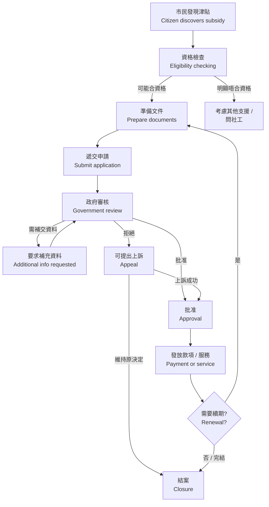
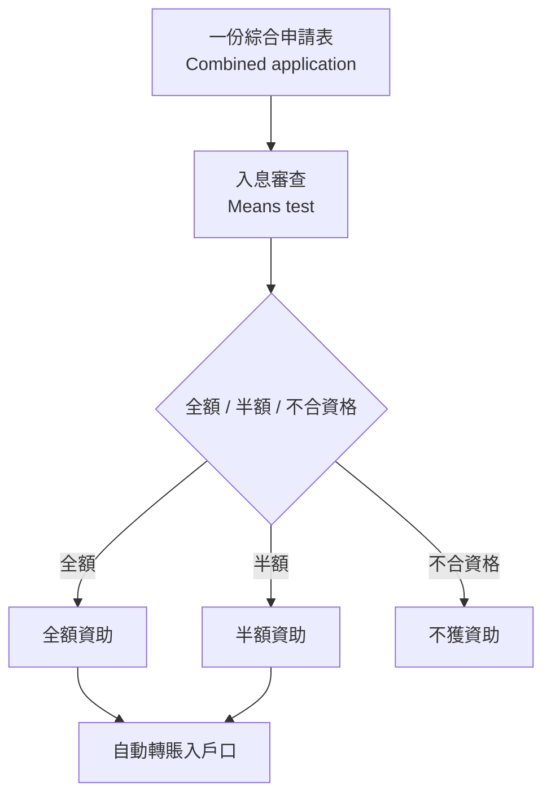
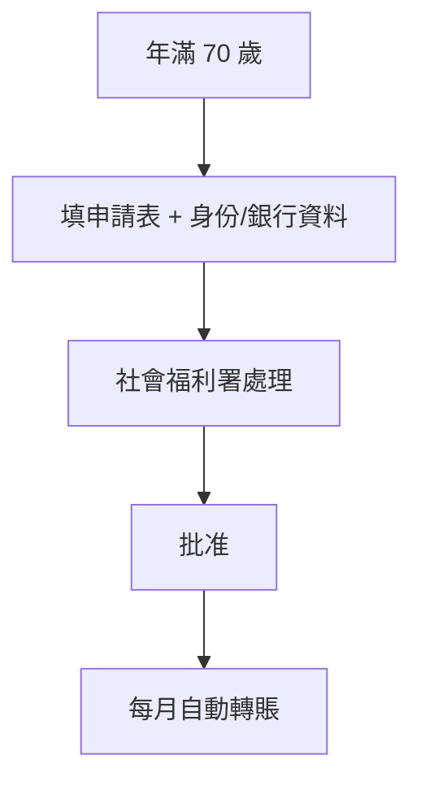
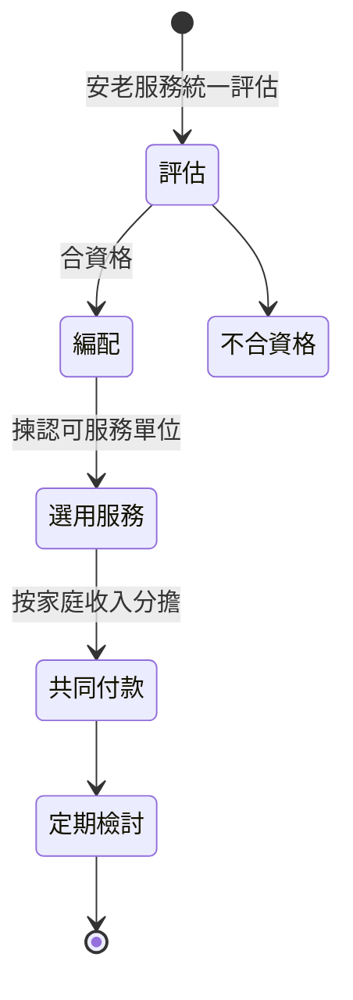
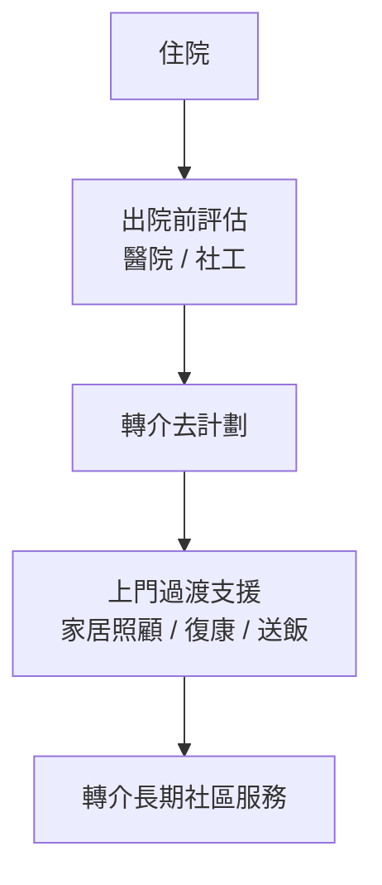

# 申請流程 · Application Workflows

> Seed draft. The generic journey below reflects the common structure of HK
> subsidy applications. **Official per-stage timelines and channels must be
> confirmed** by kb-workflow-analyst against each scheme's official guide; items
> not yet confirmed are `⚠️ Needs Manual Review`.

## Generic end-to-end journey

**Steps (plain 中文):**

1. **發現津貼** — 透過本 App、政府網站或社工得知。
2. **資格檢查** — 對照年齡、學生身分、收入、資產、居港等條件。⚠️ Needs Manual Review（各計劃條件以官方為準）。
3. **準備文件** — 身份證、住址證明、收入證明、學生 / 年齡 / 殘疾證明等。
4. **遞交申請** — 網上（SFO E-link / iAM Smart）、郵寄或親身。
5. **政府審核** — 核對文件與資格。⚠️ 審核時間以官方為準。
6. **要求補充資料** — 如文件不齊或需澄清，會通知補交。
7. **批准 / 拒絕** — 以通知書為準。
8. **上訴** — 如被拒，可按official機制提出。⚠️ 上訴期限以官方為準。
9. **發放** — 自動轉賬 / 直接減免 / 服務券 / 上門服務。
10. **續期** — 部分計劃需每年重新申請或審查。
11. **結案 / 取消** — 不再符合資格、遷離、或計劃完結。

## A. 入息審查學生資助（綜合申請）— Textbook / Travel / Internet

三項中小學津貼共用一份「學生資助計劃」綜合申請表及同一次入息審查。

- 遞交渠道：SFO E-link 網上 / 郵寄。⚠️ 申請期以官方為準。[1]
- 正領綜援家庭：學校相關開支已涵蓋於綜援，一般毋須重複申請。

## B. 免審查長者津貼 — Old Age Allowance（生果金）

- 毋須入息 / 資產審查（70 歲或以上）。⚠️ 確認年齡與居港規定。[2]
- 不可同時領取長者生活津貼或綜援。

## C. 服務券 / 社區照顧 — Community Care Service Voucher

- 先經統一評估，再編配服務券；費用按家庭入息共同付款。⚠️ 確認評估準則與付款比例。[2]

## D. 出院長者支援 — Integrated Discharge Support

- 由醫院 / 社工評估及轉介，非自行網上申請。⚠️ 確認年齡門檻與服務期。[2][3]

# Source References

1. WFSFAA SFO — Primary & Secondary schemes:
   https://www.wfsfaa.gov.hk/en/sfo/primarysecondary/tt/overview.php
2. Social Welfare Department — Elderly / Social Security:
   https://www.swd.gov.hk/en/index/site_pubsvc/page_elderly/
3. Hospital Authority: https://www.ha.org.hk/

> ⚠️ Needs Manual Review: confirm every timeline, application window and appeal
> period against the official guides before marking `status: verified`.
